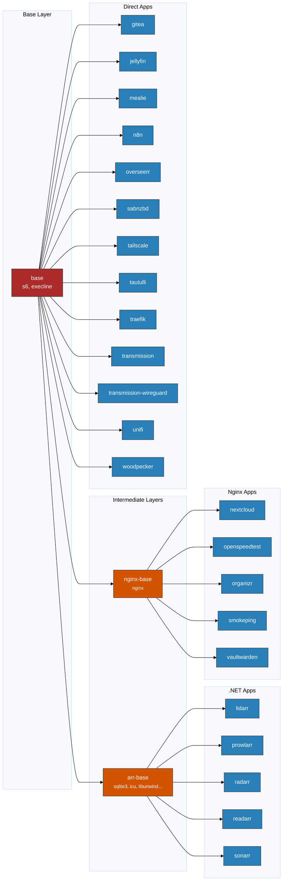

# Architecture

How daemonless container images are structured and built.

## Image Layers



## Layer Descriptions

### Base Layer

The `base` image provides the foundation for all daemonless containers:

- **FreeBSD 15** (or 14) minimal base
- **s6** - Process supervision
- **execline** - Scripting language for s6
- **FreeBSD-utilities** - Core utilities

### Intermediate Layers

| Image | Purpose | Key Packages |
|-------|---------|--------------|
| **arr-base** | .NET runtime for *arr apps | sqlite3, icu, libunwind, .NET compat |
| **nginx-base** | Web server base | nginx |

### Application Layer

Final images that users run. Each inherits from either:

- `base` - Direct apps (Python, Go, Node.js apps)
- `arr-base` - .NET applications (Radarr, Sonarr, etc.)
- `nginx-base` - PHP/web applications (Nextcloud, Organizr, etc.)

## Build Order

When a base image changes, dependent images must be rebuilt:

1. **base** changes → rebuild everything
2. **arr-base** changes → rebuild *arr apps only
3. **nginx-base** changes → rebuild nginx apps only

This is handled automatically by the [cascade rebuild workflow](https://github.com/daemonless/daemonless/blob/main/.github/workflows/trigger-cascade.yml).

## Image Inheritance

```
FreeBSD 15 Base
└── base (s6, execline)
    ├── arr-base (sqlite3, icu, .NET compat)
    │   ├── radarr
    │   ├── sonarr
    │   ├── prowlarr
    │   ├── lidarr
    │   └── readarr
    ├── nginx-base (nginx)
    │   ├── nextcloud
    │   ├── organizr
    │   ├── openspeedtest
    │   ├── smokeping
    │   └── vaultwarden
    ├── transmission
    ├── tautulli
    ├── sabnzbd
    ├── jellyfin
    ├── gitea
    ├── traefik
    ├── tailscale
    ├── overseerr
    ├── mealie
    ├── n8n
    ├── unifi
    └── woodpecker
```

