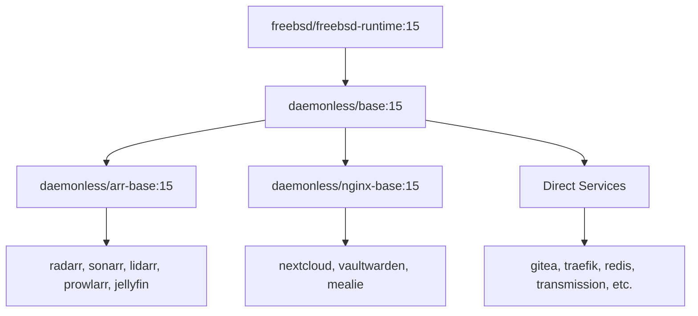

# Development

This guide covers the internal architecture, conventions, and patterns for building and contributing to daemonless containers.

## Architecture Overview

### Image Hierarchy



All images inherit from `base:15` which provides s6 supervision and PUID/PGID support. Specialized bases add runtime dependencies:

- **arr-base** - .NET runtime and libraries for *arr applications
- **nginx-base** - nginx pre-installed for web applications

### Repository Structure

Each image is a standalone git repo:

```
<app>/
├── Containerfile           # Build from upstream binaries (:latest tag)
├── Containerfile.pkg       # Build from FreeBSD packages (:pkg tag)
├── .woodpecker.yml         # CI/CD pipeline
├── root/                   # Files copied into container
│   └── etc/
│       ├── cont-init.d/    # Initialization scripts
│       │   └── 20-<app>    # App-specific init
│       └── services.d/     # s6 service definitions
│           └── <app>/
│               ├── run     # Service start script
│               └── run.pkg # Variant for :pkg builds (optional)
├── README.md
└── LICENSE
```

## Labels Reference

### io.daemonless.* Labels

| Label | Required | Purpose | Example |
|-------|----------|---------|---------|
| `io.daemonless.port` | Yes | Primary listening port(s) | `"7878"`, `"80,443,8080"` |
| `io.daemonless.category` | Yes | Service classification | `"Media Management"` |
| `io.daemonless.packages` | Yes | FreeBSD packages to install | `"${PACKAGES}"` |
| `io.daemonless.volumes` | No | Suggested volume mounts | `"/movies,/downloads"` |
| `io.daemonless.upstream-url` | No | Version check API endpoint | `"https://radarr.servarr.com/v1/..."` |
| `io.daemonless.upstream-sed` | No | Regex to extract version | `"s/.*\"version\":\"\\([^\"]*\\)\".*/\\1/p"` |
| `io.daemonless.arch` | No | Supported architecture | `"amd64"` (default) |
| `io.daemonless.type` | No | Image type (base images only) | `"base"` |
| `io.daemonless.wip` | No | Work-in-progress flag | `"true"` |
| `io.daemonless.pkg-name` | No | Package name for :pkg builds | `"radarr"` |
| `io.daemonless.base` | No | Base image type | `"nginx"` |

### Category Values

- `Media Management` - radarr, sonarr, lidarr, prowlarr, overseerr
- `Media Servers` - jellyfin, plex, tautulli
- `Downloaders` - sabnzbd, transmission
- `Infrastructure` - traefik, gitea, woodpecker, tailscale
- `Databases` - redis, immich-postgres
- `Photos & Media` - immich-server, immich-ml
- `Utilities` - nextcloud, vaultwarden, mealie, n8n, smokeping

### Special Annotations

For .NET applications (arr-base derivatives):

```dockerfile
# Required in Containerfile as a label hint
LABEL org.freebsd.jail.allow.mlock="required"
```

```bash
# Required at runtime
podman run --annotation 'org.freebsd.jail.allow.mlock=true' ...
```

## Containerfile Patterns

### Standard Pattern (:latest)

Downloads binaries from upstream for bleeding-edge versions:

```dockerfile
ARG BASE_VERSION=15
FROM ghcr.io/daemonless/base:${BASE_VERSION}

ARG PACKAGES="app-package dependency1 dependency2"
ARG VERSION=""
ARG UPSTREAM_URL="https://api.example.com/releases"
ARG UPSTREAM_SED="s/.*\"version\":\"\\([^\"]*\\)\".*/\\1/p"

# OCI Labels (required)
LABEL org.opencontainers.image.title="App Name"
LABEL org.opencontainers.image.description="App description"
LABEL org.opencontainers.image.source="https://github.com/daemonless/app"
LABEL org.opencontainers.image.version="${VERSION}"

# Daemonless Labels (required)
LABEL io.daemonless.port="8080"
LABEL io.daemonless.category="Category"
LABEL io.daemonless.packages="${PACKAGES}"
LABEL io.daemonless.upstream-url="${UPSTREAM_URL}"
LABEL io.daemonless.upstream-sed="${UPSTREAM_SED}"

# Environment
ENV HOME=/config

# Install packages
RUN pkg update && pkg install -y ${PACKAGES} && \
    pkg clean -ay && rm -rf /var/cache/pkg/*

# Download and install app
RUN APP_VERSION=${VERSION:-$(fetch -qo - "${UPSTREAM_URL}" | sed -n "${UPSTREAM_SED}" | head -1)} && \
    fetch -qo /tmp/app.tar.gz "https://releases.example.com/app-${APP_VERSION}.tar.gz" && \
    mkdir -p /app && \
    tar xzf /tmp/app.tar.gz -C /app --strip-components=1 && \
    rm /tmp/app.tar.gz && \
    echo "${APP_VERSION}" > /app/version

# Config directory
RUN mkdir -p /config && chown -R bsd:bsd /config /app

# Copy s6 service files
COPY root/ /
RUN chmod +x /etc/services.d/*/run /etc/cont-init.d/* 2>/dev/null || true

EXPOSE 8080
VOLUME /config
```

### Package Pattern (:pkg)

Uses FreeBSD packages for stable, tested versions:

```dockerfile
ARG BASE_VERSION=15
FROM ghcr.io/daemonless/base:${BASE_VERSION}

ARG PKG_NAME=app
ARG PACKAGES="app"

# Labels must match Containerfile (except pkg-specific)
LABEL io.daemonless.pkg-name="${PKG_NAME}"
LABEL io.daemonless.pkg-source="containerfile"

# Install from FreeBSD packages
RUN pkg update && pkg install -y ${PACKAGES} && \
    pkg clean -ay && rm -rf /var/cache/pkg/*

# Config directory
RUN mkdir -p /config && chown -R bsd:bsd /config

# Copy s6 service files (may use run.pkg variant)
COPY root/ /
RUN if [ -f /etc/services.d/app/run.pkg ]; then \
      mv /etc/services.d/app/run.pkg /etc/services.d/app/run; \
    fi && \
    chmod +x /etc/services.d/*/run /etc/cont-init.d/* 2>/dev/null || true

EXPOSE 8080
VOLUME /config
```

### Multi-stage Pattern

For Node.js or compiled applications:

```dockerfile
ARG BASE_VERSION=15
FROM ghcr.io/daemonless/base:${BASE_VERSION} AS builder

# Install build dependencies
RUN pkg update && pkg install -y node npm python3 gcc ...

WORKDIR /app

# Build application
COPY package*.json ./
RUN npm ci
COPY . .
RUN npm run build
RUN npm prune --production

# Runtime stage
FROM ghcr.io/daemonless/base:${BASE_VERSION}

ARG PACKAGES="node"

# Install runtime dependencies only
RUN pkg update && pkg install -y ${PACKAGES} && pkg clean -ay

# Copy built artifacts
COPY --from=builder --chown=bsd:bsd /app /app

COPY root/ /
RUN chmod +x /etc/services.d/*/run /etc/cont-init.d/* 2>/dev/null || true

EXPOSE 8080
VOLUME /config
```

## s6 Service Files

### Service Run Script

`root/etc/services.d/<app>/run`:

```bash
#!/bin/sh
exec 2>&1

# Wait for dependencies (optional)
# s6-svwait -U /run/s6/services/redis

cd /app
exec s6-setuidgid bsd /app/bin/app --config /config
```

!!! tip "Always use exec"
    The `exec` command replaces the shell with the application, ensuring proper signal handling and process supervision.

### Init Script

`root/etc/cont-init.d/20-<app>`:

```bash
#!/bin/sh
echo "[init] Initializing app..."

# Create required directories
mkdir -p /config/data /config/logs
chown -R bsd:bsd /config

# Generate default config if missing
if [ ! -f /config/app.conf ]; then
    cp /app/app.conf.default /config/app.conf
    chown bsd:bsd /config/app.conf
fi

echo "[init] App initialized"
```

### Readiness Check

For services that need health checks before reporting ready:

```bash
#!/bin/sh
exec 2>&1

# Signal readiness when health endpoint responds
s6-ready-when "curl -sf http://localhost:8080/health" &

cd /app
exec s6-setuidgid bsd /app/bin/app
```

## Environment Variables

### Base Container

| Variable | Default | Purpose |
|----------|---------|---------|
| `PUID` | `1000` | User ID for bsd user |
| `PGID` | `1000` | Group ID for bsd group |
| `TZ` | `UTC` | Timezone |

### Logging (s6)

| Variable | Default | Purpose |
|----------|---------|---------|
| `S6_LOG_ENABLE` | `1` | Enable s6-log |
| `S6_LOG_DEST` | `/config/logs/daemonless` | Log directory |
| `S6_LOG_MAX_SIZE` | `1048576` | Max log file size (1MB) |
| `S6_LOG_MAX_FILES` | `10` | Rotated files to keep |
| `S6_LOG_STDOUT` | `1` | Mirror logs to stdout |

### .NET Applications

| Variable | Default | Purpose |
|----------|---------|---------|
| `CLR_OPENSSL_VERSION_OVERRIDE` | `35` | OpenSSL version hint |
| `DOTNET_SYSTEM_NET_DISABLEIPV6` | `1` | Disable IPv6 in .NET |
| `HOME` | `/config` | .NET home directory |

## Build System

### Scripts

| Script | Purpose |
|--------|---------|
| `scripts/build.sh` | Main build engine (downloaded by CI) |
| `scripts/local-build.sh` | Local development builds |
| `scripts/build-ocijail.sh` | Patch ocijail for mlock support |
| `scripts/check-upstream-dynamic.sh` | Check for upstream updates |

### Local Building

```bash
# Build specific image
./scripts/local-build.sh 15 radarr latest
./scripts/local-build.sh 15 radarr pkg
./scripts/local-build.sh 15 radarr pkg-latest

# Build all images
./scripts/local-build.sh 15

# Build with options
./scripts/local-build.sh 15 radarr latest --push
```

### Tag Strategy

| Tag | Source | Packages | Use Case |
|-----|--------|----------|----------|
| `:latest` | Upstream binaries | FreeBSD latest | Bleeding edge |
| `:pkg` | Containerfile.pkg | FreeBSD quarterly | Stable |
| `:pkg-latest` | Containerfile.pkg | FreeBSD latest | Middle ground |
| `:<version>` | Auto-generated | Matches :latest | Pinned version |

### CI/CD Pipeline

Standard `.woodpecker.yml`:

```yaml
steps:
  - name: build-latest
    image: /bin/sh
    environment:
      GITHUB_TOKEN: { from_secret: GITHUB_TOKEN }
      GITHUB_ACTOR: { from_secret: GITHUB_USER }
    commands:
      - |
        mkdir -p scripts
        fetch -qo scripts/build.sh \
          "https://raw.githubusercontent.com/daemonless/daemonless/build-v1.1.1/scripts/build.sh"
        chmod +x scripts/build.sh
        ./scripts/build.sh \
          --doas \
          --registry ghcr.io \
          --image ghcr.io/daemonless/<app> \
          --containerfile Containerfile \
          --tag latest \
          --tag-version \
          --skip-wip \
          --login --push

  - name: build-pkg
    # Same but with Containerfile.pkg, --base-version 15-quarterly, --tag pkg

  - name: build-pkg-latest
    # Same but with Containerfile.pkg, --base-version 15, --tag pkg-latest

when:
  - event: push
    branch: main
    path:
      exclude: ["*.md", "docs/**", "LICENSE", ".gitignore"]
  - event: manual
```

## Adding a New Image

### 1. Create Repository

```bash
cd /path/to/daemonless
mkdir myapp && cd myapp
git init
```

### 2. Create Containerfile

Use the standard pattern above. Required labels:

```dockerfile
LABEL io.daemonless.port="8080"
LABEL io.daemonless.category="Utilities"
LABEL io.daemonless.packages="${PACKAGES}"
```

### 3. Create Service Files

```bash
mkdir -p root/etc/services.d/myapp root/etc/cont-init.d
```

Create `root/etc/services.d/myapp/run`:

```bash
#!/bin/sh
exec 2>&1
exec s6-setuidgid bsd /app/myapp
```

### 4. Create Containerfile.pkg

If a FreeBSD package exists, sync all labels from Containerfile and add:

```dockerfile
LABEL io.daemonless.pkg-name="myapp"
LABEL io.daemonless.pkg-source="containerfile"
```

### 5. Create .woodpecker.yml

Copy from an existing image and update the image name.

### 6. Test Locally

```bash
# Build
doas podman build -t localhost/myapp:test -f Containerfile .

# Run
doas podman run --rm -it -p 8080:8080 localhost/myapp:test

# Check logs
doas podman logs myapp
```

### 7. Push to Registry

```bash
git add .
git commit -m "Initial myapp container"
git remote add origin git@github.com:daemonless/myapp.git
git push -u origin main
```

## Conventions Checklist

- [ ] Use `fetch` instead of `curl` (included in FreeBSD base)
- [ ] Clean pkg cache: `pkg clean -ay && rm -rf /var/cache/pkg/*`
- [ ] Set ownership: `chown -R bsd:bsd /config /app`
- [ ] Make scripts executable: `chmod +x /etc/services.d/*/run`
- [ ] Use `s6-setuidgid bsd` in run scripts
- [ ] Create /config directory and set as VOLUME
- [ ] Keep Containerfile and Containerfile.pkg labels in sync
- [ ] Use ARG for BASE_VERSION, PACKAGES, VERSION
- [ ] Include upstream-url and upstream-sed for version detection
- [ ] Add `io.daemonless.wip="true"` for incomplete images

## Troubleshooting

### .NET Apps Won't Start

Ensure ocijail is patched and annotation is set:

```bash
./scripts/build-ocijail.sh
podman run --annotation 'org.freebsd.jail.allow.mlock=true' ...
```

See [ocijail Patch](ocijail-patch.md) for details.

### Permission Denied

Check PUID/PGID match host user:

```bash
podman run -e PUID=$(id -u) -e PGID=$(id -g) ...
```

### Service Not Starting

Check s6 logs:

```bash
podman exec myapp cat /config/logs/daemonless/myapp/current
```

Or check init output:

```bash
podman logs myapp 2>&1 | grep -A5 "\[init\]"
```

### Build Fails on pkg install

Check package name exists:

```bash
pkg search myapp
pkg rquery '%n %v' myapp
```
